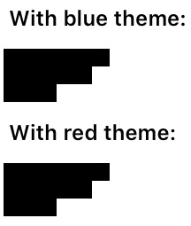
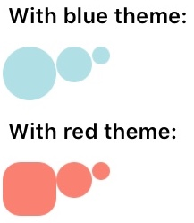
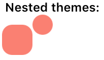
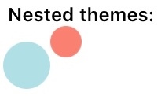

# 💅 Create a theming tools for React Native
The [final result](https://snack.expo.io/@cglacet/themes-in-react-native) is on snack.

The goal is to achieve a simple implementation of a theming tool inspired from what is described by [styled-components.com](https://www.styled-components.com/docs/advanced#theming).  This is just a pretext to explore React Native/ES6 features and also talk a bit about python and functional programming (especially [first-class functions](https://www.wikiwand.com/en/First-class_function)).
The tool we aim at creating here should allow to add theme by inserting JSX component around existing components. Without modifying any view style directly (black squares), we are going to go from this:

To this:


As described in styled-components, this (component) tool would be called a *theme provider* and would look like this:
```jsx
<Button>Normal</Button>
<ThemeProvider theme={theme}>
	<Button>Themed</Button>
</ThemeProvider>
```

The `ThemeProvider` modifies the way `Button`s will render, affecting only their styles. In the case of React Native, the `theme` is a simple [javascript-css](https://facebook.github.io/react-native/docs/style) object (unlike in styled-components where it is pure Css).  Note that we could also [use plain css in react native](https://github.com/sabeurthabti/react-native-css), but that's another story	.  In case you don't know react native, here is what a javascript stylesheet look like in here:

```jsx
const theme = {
	borderRadius: 15,
	backgroundColor: 'blue'
};
```

If you were aiming at having a theme in plain React Native, the way you would achieve this is probably by defining a static constant `theme` that would be accessed by every component that need to use it:

```jsx
const theme = { /**/ };
const anotherTheme = { /**/ };
/* Somewhere else */
<View style={[theme, { /* ownStyle */ }]} />
<View style={[theme,  { /* ownStyle */ }]} />
<View style={[anotherTheme,  { /* ownStyle */ }]} />
```

Or maybe that's not your favorite technique, let me know :).

When your solution look like this, if you have nested components, you'll have to pass the theme in each component props (that's how components' arguments are called in React).I don't think this approach is really problematic but let's try to implement a component-level style management anyway and we will compare the two approaches in the end.

## The ThemeProviderView
The theme provider is the component in charge of receiving the themes in order to dispatch them to the other components. First lets make a simple theme provider that only handle direct children:

**Adding the `theme` prop to direct children**

The role of the theme provider will be to offer its *direct* children a mean to retrieve the value stored in its `theme` props.

```jsx
class ThemeProviderView extends React.PureComponent {
  render(){
    const childrenProps = {theme: this.props.theme}
    const children = React.Children.map(this.props.children, c =>
      React.cloneElement(c, childrenProps)
    );
    return <View>{children}</View>
  }
}
```

This contains several interesting details. First, we are using an unusual `map` function which is not the JS built-in one. Why is this so strange, why not use `this.props.children.map)`? Well its because `this.props.children` is [not exactly what it looks like](https://zhenyong.github.io/react/tips/children-props-type.html), you may think it's an array, but it's not always, when a component has a single child, `this.props.children` is a single component (not a singleton). That's why [`React.Children`](https://reactjs.org/docs/react-api.html#reactchildren) provides some utilities to deal with children props.

Secondly, we duplicate the original child `c` to return a new child with extra props: `React.cloneElement(c, childrenProps)`. The [`cloneElement`](https://reactjs.org/docs/react-api.html#cloneelement) function simply


**Adding the `theme` prop to every descendant component**

We will modify the `ThemeProviderView` so it will allow providing the themes to its whole  component-sub-tree.  To do so we will simply pass the props recursively:

```jsx
export class ThemeProviderView extends React.PureComponent {
  render(){
    const {theme, ...otherProps} = this.props;
    const childrenProps = {theme};
    const children = addProps(this.props.children, childrenProps);
    return <View {...otherProps}>{children}</View>
  }
}

function addProps(component, props){
  return React.Children.map(component, (child) => {
    const grandChildren = addProps(child.props.children, props);
    const newProps = (grandChildren)? {...props, children: grandChildren}:props;
    return React.cloneElement(child, newProps);
  });
}
```

## Using the theme in to modify descendants rendering
The provider gave to any descendant access to the `theme` by adding a prop called `theme`  to their props. A descendant just need to add these styling information to its own style. To do so we will simply use the fact that a style can be defined (recursively) as a list of styles.

**theme.js**
```jsx
class ThemableView extends React.PureComponent {
  render(){
    const {style, theme, ...otherProps} = this.props;
    return <View style={[style, theme]} {...otherProps} />
  }
}
```

This also uses the spread operator `...`  for which you can [find details here.](https://developer.mozilla.org/fr/docs/Web/JavaScript/Reference/Op%C3%A9rateurs/Syntaxe_d%C3%A9composition) .

Using this we are able to make things work already, lets consider the following application that displays squares (not so useful unless you are really into squares):

**App.js**

```jsx
import * as React from 'react';
import { View, Text } from 'react-native';

const baseStyle = {backgroundColor:'black', marginTop: 10, marginBottom: 10};
const testComponents = [
  <View style={{...baseStyle, height: 30, width: 30}} />,
  <View style={{...baseStyle, height: 20, width: 20}} />,
  <View style={{...baseStyle, height: 10, width: 10}} />
];

export default class App extends React.PureComponent {
  render() {
    return (
        <View style={{margin: 20, padding: 20}}>
          <Text> With blue theme: </Text>
          <View style={{flexDirection: "row"}}>
              {testComponents}
          </View>
          <Text> With red theme: </Text>
          <View style={{flexDirection: "row"}}>
               {testComponents}
          </View>
        </View>
    );
  }
}
```

This application shows the following:


Lets add some instances of the `ThemeProviderView ` and the `ThemableView` we defined in *theme.js* to make this look a bit rounder and colorful (sorry square lovers):

**App.js**
```jsx
import * as React from 'react';
import { View, Text } from 'react-native';
import { ThemeProviderView, ThemableView } from './theme.js';

// Lets define two themes:
const themes = {
  salmon: {backgroundColor: 'salmon', borderRadius: 10},
  sky: {backgroundColor: 'powderblue', borderRadius: 100},
};

const baseStyle = {backgroundColor:'black', marginTop: 10, marginBottom: 10};
// View -> ThemableView
const testComponents = [
  <ThemableView style={{...baseStyle, height: 30, width: 30}} />,
  <ThemableView style={{...baseStyle, height: 20, width: 20}} />,
  <ThemableView style={{...baseStyle, height: 10, width: 10}} />
];

export default class App extends React.PureComponent {
	render() {
    return (
        <View style={{margin: 20, padding: 20}}>
          <Text> With blue theme: </Text>
	        // View -> ThemeProvider
          <ThemeProviderView style={{flexDirection: "row"}}>
              {testComponents}
          </ThemeProviderView>
          <Text> With red theme: </Text>
			// View -> ThemeProvider
          <ThemeProviderView style={{flexDirection: "row"}}>
              {testComponents}
          </ThemeProviderView>
        </View>
    );
  }
}
```

This outputs the same views, but this time the different themes are applied:


## A real theme provider component
The current theme provider `ThemeProviderView` has two issues, but mainly: It doesn't support nesting (one theme overriding a parent theme).

If we modify our render method in *App.js* with nested `ThemeProvider` (a blue theme containing a red theme):

```jsx
render(){
  return (
    <Text> Nested themes: </Text>
    <ThemeProvider theme={themes.sky}>
      <View>
        <View style={{flexDirection: "row"}}>
          <ThemeProvider theme={themes.salmon}>
            <ThemableView style={{...baseStyle, height: 30, width: 30}} />
          </ThemeProvider>
          <ThemableView style={{...baseStyle, height: 20, width: 20}} />
        </View>
      </View>
    </ThemeProvider>
  );
}
```

Then we end up with:

Instead of:


The solution to this problem consists in a single line addition in *theme.js*:
```diff
function addProps(component, props){
  return React.Children.map(component, (child) => {
+   if (child.type.prototype === ThemeProvider.prototype) return child;
    const grandChildren = addProps(child.props.children, props);
    const newProps = (grandChildren)? {...props, children: grandChildren}:props;
    return React.cloneElement(child, newProps);
  });
}
```

This looks a bit complex but that's just a syntax issue, what that line mean is "if the child is an instance of `ThemeProvider.prototype` then return it", and thus stop the propagation of the current theme props down the tree. Usually in javascript these statements look like `child instanceof ThemeProvider.prototype` but sadly [we can't use that condition here](https://stackoverflow.com/a/39387621/1720199).

The theme provider have a second problem, it's a view, but from the kind of service this component is supposed to give, it's a bit weird, it should not change the virtual DOM. This is actually quite easy to fix, we only need to return its children directly instead of encapsulating them in a `View`.

**theme.js**
```diff
-export class ThemeProviderView extends React.PureComponent {
+export class ThemeProvider extends React.PureComponent {
  render(){
    const {theme, ...otherProps} = this.props;
    const childrenProps = {theme};
-   const children = addProps(this.props.children, childrenProps);
-   return <View {...otherProps}>{children}</View>
+   return addProps(this.props.children, childrenProps);
  }
}
```

Notice that if we had done that in the first version (where nesting wasn't allowed) we wouldn't have been able to display the `ThemableView`s in rows (as we couldn't encapsulate them together in a common parent `View`). But since it is now possible we really don't need the theme provider to be a disguised `View`. Here is what the `testComponents`  from *App.js* look like now:

```jsx
const testComponents = (
  <View style={{flexDirection: "row"}}>
    <ThemableView style={{...baseStyle, height: 30, width: 30}} />
    <ThemableView style={{...baseStyle, height: 20, width: 20}} />
    <ThemableView style={{...baseStyle, height: 10, width: 10}} />
  </View>
);
```

## Factory to turn React components in Themable components
The goal is to provide a wrapper that will transform any React component in a component that read its `theme` props and use it as part of its style (practically that more or less means moving one prop value to another).

Providing a wrapper for react component is equivalent to create a decorator for a class. The idea is to pass a class as argument of a function, and then return a modified version of that class. That may sound odd, but if you are used to function/method decorators, this is exactly the same principle.

I fell like this is a bit unusual for javascript developers, but its quite common in some other languages. I'll first show a python example and then come back to the JS code. Here is how you would decorate a function in python so it says "Hello!" every time its called:

```python
# This function takes a function as parameter and returns a function:
def be_polite_say_hello(function):
	# This is the function we are creating:
  def polite_function(*args, **kwargs):
    print("Hello!")
    return function(*args, **kwargs)
  # Now that we have defined a new function, we return it
  return polite_function

def sum(x, y):
	return x + y

sum(2, 3)  # nothing, rude

# Please make that function polite:
polite_sum = be_polite_say_hello(sum)
polite_sum(2, 3)  # says "Hello!" :)
```

*Remarks concerning python syntax* `*args` is the Python spread operator, equivalent to `...args`in JS. `**kwargs`is also a spread operator but dedicated to dictionaries (JS simply have the same operator for both lists and objects). In python, function arguments are 1) any number of unnamed `args`followed by 2) any number of keyword args or `kwargs` for short. Notice that the inner function `polite_function` needs to get all parameters that `function`would normally take as it will have to delegate them to it.

In python there is a shorthand for wrapping a function in a decorator using annotations:
```python
@be_polite_say_hello
def polite_prod(x, y):
	return x * y

polite_prod(2, 3)  # says "Hello!"
```

Lets now code the same toy example in JS:
```jsx
// This function takes a function as parameter and returns a function:
function bePoliteSayHello(f) {
  // This is the function we are creating:
  function politeFunction(...args){
    console.log("Hello!");
    return f(...args);
  }
  // Now that we have defined a new function, we return it
  return politeFunction;
}

function sum(x){
	return x**3;
}

sum(2, 3);  // JS is as rude as Python

// Please make that function polite:
const politeSum = bePoliteSayHello(sum);
politeSum(2, 3)  // yay, it says Hello!
```

Yes, that's actually very close to the python code. These two tend to look more and more like each other. I just miss some Python built-ins, especially `zip` (I'm trying to have a clean `zip`version in JS typed with flow, [any help is welcome](https://stackoverflow.com/q/54689169/1720199)).

Now that you understand how function decoration works you actually know what [higher-order functions](https://www.wikiwand.com/en/Higher-order_function) are and you are ready to go one step further.

Functions can take function as input and return functions, right? And JS classes are basically [some kind of function](https://medium.com/tech-tajawal/javascript-classes-under-the-hood-6b26d2667677)? Therefore a function should also be able to take classes as input and return classes too? Yes, of course it can. Let see an example:

```jsx
// Again, this function takes a class as parameter and returns a class:
function helloOnInstanciation(Class) {
  // This is the class we are creating:
  class PoliteClass extends Class {
    constructor(...args){
      super(...args);
      console.log("Hello!");
    }
  }
  // Now that we have defined a new class, we return it
  return PoliteClass
}

// A normal JS class:
class RudeMaths {
  sum(x, y){
    return x + y;
  }
}

// We instanciate and call sum, this prints "5", rude.
const badMaths = new RudeMaths();
console.log(badMaths.sum(2, 3));

// We instanciate and call sum, this prints "Hello" then "5", nice.
const PoliteMaths = helloOnInstanciation(RudeMaths);
const goodMaths = new PoliteMaths();
console.log(goodMaths.sum(2, 3));
```

We are now ready to apply all our knowledge about good manners to build a `Themable`components factory. The goal is to transform any React component to a `Themable`component. To do so we will use the decoration technique we saw before and our factory will simply be a function that takes a class (React component) as parameter and return another class (again, a React component):

**theme.js**

```jsx
// The function takes a component as parameter and returns a component:
export function Themable(ComponentClass){
  /*This is the component we are creating
    Notice that we don't extend the `ComponentClass`,
    instead we will render a ComponentClass that we will
    modify on the fly.
  */
  class ThemableComponentClass extends React.PureComponent {
    render(){
      // We extract our props to feed them to a `ComponentClass`
      const {style, theme, children,...otherProps} = this.props;
      return (
          <ComponentClass style={[style, theme]} {...otherProps}>
              {children}
          </ComponentClass>
		);
    }
  }
  // A new component has been defined, we return it
  return ThemableComponentClass;
}
```

Just like before, using this is very easy, we simply need to call `Themable` on any React component and we will get a new kind of component that will use any `theme` props it has as a part of its own style:

*App.js*
```diff
import {
    ThemeProviderView,
-   ThemableView
+   Themable
} from './theme.js';
+ const ThemableView = Themable(View);
```

This code achieve the exact same thing as it did before (`ThemableView`instances are equal to their old versions), the advantage of the new version is that our client (here represented by the *App.js*) file can now declare any type of `Themable`component without any need of intervention from us (we are the *theme.js* file team).

## What's next?
I may be interesting to implement a *css to javascript-css* interpreter [using templates](https://developer.mozilla.org/en-US/docs/Web/JavaScript/Reference/Template_literals#Tagged_templates)?
